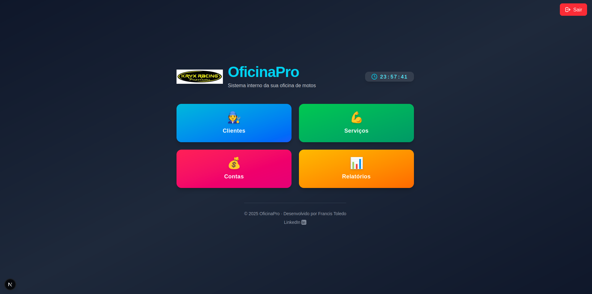
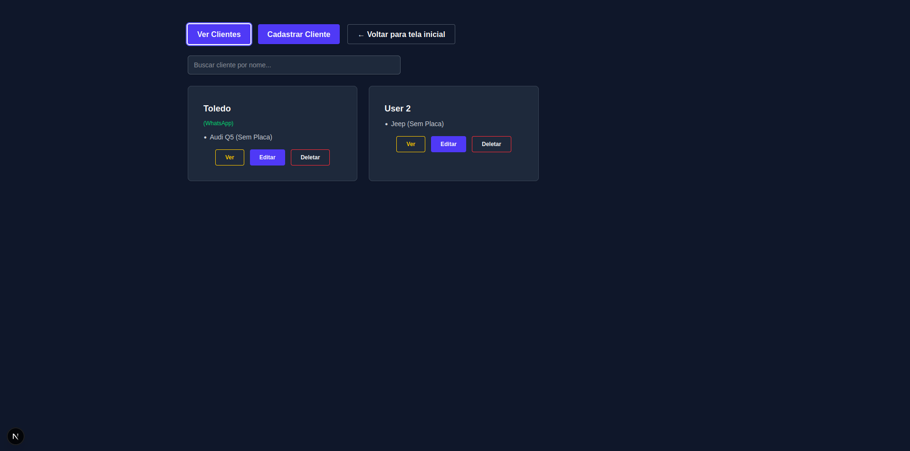
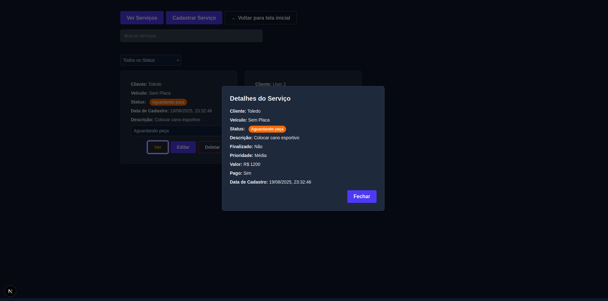
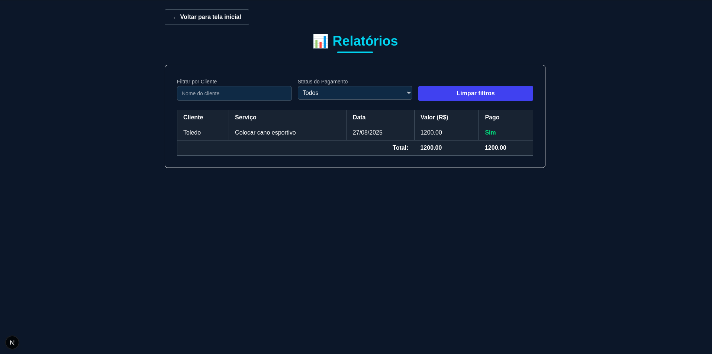

# 📋 OficinaPro - Sistema de Gerenciamento para Oficinas (Full-Stack)

[](https://github.com/ToledoNT/OficinaPro)  
[](https://github.com/ToledoNT/OficinaPro)

## 🚀 Visão Geral

O **OficinaPro** é um sistema completo para gerenciamento de oficinas mecânicas, unindo um **backend robusto** e um **frontend moderno**.  
Permite gerenciar clientes, veículos, serviços, contas e gerar relatórios financeiros de maneira prática e eficiente.

O sistema está atualmente em **fase de desenvolvimento ativo**, com novas funcionalidades sendo adicionadas constantemente.

---

## 🏗️ Arquitetura do Sistema

### Frontend
- **Next.js** (App Router)  
- **React**  
- **Tailwind CSS**  
- **Framer Motion** (animações)  
- **TypeScript**

### Backend
- **Node.js**  
- **Express**  
- **TypeScript**  
- **Prisma** (ORM)  
- **MongoDB** (banco de dados)

---

## ✨ Funcionalidades
  

### 🔑 Sistema de Autenticação
  
- Controle de sessão seguro  
- Middleware de autenticação  

### 🧑‍🔧 Módulo de Clientes
  
- CRUD completo de clientes  
- Histórico de veículos e serviços  
- Busca avançada  

### 🔧 Módulo de Serviços
  
- Cadastro de serviços realizados  
- Controle de status  
- Associação com clientes e veículos  

### 💰 Módulo Contas
  
- Controle de contas a pagar e receber  
- Fluxo de caixa detalhado  
- Integração com serviços financeiros  

### 📊 Módulo de Relatórios
  
- Relatórios financeiros detalhados  
- Visualização por período, cliente ou serviço  

---

## ⚙️ Instalação

1. Clone o repositório:
```bash
git clone https://github.com/ToledoNT/OficinaPro.git

2. Instale as dependências do backend:
cd backend
npm install

3. Instale as dependências do frontend:
cd ../frontend
npm install

4. Configure variáveis de ambiente (.env) para backend e frontend.

5. Execute o projeto:

# Backend
npm run dev

# Frontend
npm run dev

## 📌 Fim do README
O **OficinaPro** está em constante evolução.  
Sinta-se à vontade para contribuir, abrir issues ou sugerir melhorias! 🚀